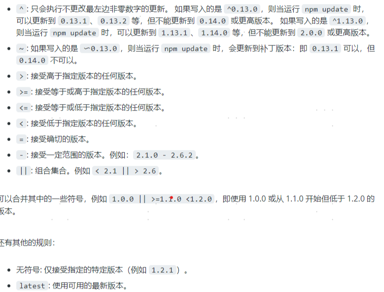

#### npm
git config --global http.sslVerify false

npm config set strict-ssl false

cnpm和npm的区别

好用的npm包：

https://www.cnblogs.com/ajaemp/p/13810123.html

https://baijiahao.baidu.com/s?id=1709660130319019877

https://blog.csdn.net/yzx15855401351/article/details/83055146

安装node 稳定版，nvm-windows 【需要先卸载node】  ---- 管理员身份

配置环境变量(可通过 window+r —> sysdm.cpl —> 高级 —>环境变量)

 NVM_HOME=H:\application\nvm\nvm所在目录

 NVM_SYMLINK=H:\application\nvm\nodejs 快捷方式所在的目录

设置nvm环境变量

nvm v   、   nvm install <version> [arch] 、 nvm list <available>、nvm ls

nvm use [version] [arch] 用管理员身份、 否则切换失败（返回乱码）

https://www.runoob.com/w3cnote/nvm-manager-node-versions.html

https://blog.csdn.net/xiaomin_er/article/details/105188483

    切换到国内淘宝镜像
    npm set registry http://registry.npmjs.org/
    npm --registry=https://registry.npm.taobao.org install
    npm config get registry

    cnpm：npm install -g cnpm --registry=https://registry.npmmirror.com
    https://npmmirror.com/    
   
    C:\Users\dscshap3939>npm install -g cnpm --registry=https://registry.npmmirror.com
    npm ERR! code ETIMEDOUT
    npm ERR! syscall connect
    npm ERR! errno ETIMEDOUT
    npm ERR! network request to https://registry.npmmirror.com/cnpm failed, reason: connect ETIMEDOUT 122.225.34.143:443
    npm ERR! network This is a problem related to network connectivity.
    npm ERR! network In most cases you are behind a proxy or have bad network settings.
    npm ERR! network
    npm ERR! network If you are behind a proxy, please make sure that the
    npm ERR! network 'proxy' config is set properly.  See: 'npm help config'

    npm ERR! A complete log of this run can be found in:
    npm ERR!     C:\Users\dscshap3939\AppData\Local\npm-cache\_logs\2021-10-09T01_49_44_070Z-debug.log

https://www.cnblogs.com/goldlong/p/8027997.html

https://www.cnblogs.com/xuzhudong/p/8714876.html

#### pac代理

https://blog.csdn.net/fanhu6816/article/details/53812724

package.json和 package_lock.json

https://blog.csdn.net/qq_34629352/article/details/73752936

https://blog.csdn.net/oldfish__/article/details/104421232

https://docs.npmjs.com/cli/v7/commands/npm-link

npmrc代理

proxy代理

------------------------------------

package_lock.json 固定版本

npm update时更新

主版本  、进行不兼容的API更改时

次版本、向后兼容的方式添加功能

补丁版本、向后兼容的方式缺陷修复

如果有新的  次版本  或  补丁版本 ，并且输入了 `npm update`，则已安装的版本会被更新，并且 `package-lock.json` 文件会被新版本填充。`package.json` 则保持不变。

若要发觉软件包的  新版本，则运行 `npm outdated`。

批量更新到主版本： npm install -g npm-check-updates       然后  ncu  -u

------------------------------

npm install --global --production windows-build-tools

npm uninstall 包名  移除package.json的引用了么，【也考虑开发环境】？

npm view axios versions

npm view axios version 最新版本

npm info axios  //查看包的地址

npm cache clean --force

npm list 查看所以已经安装的npm软件包(包括依赖包)的最新版本，同package-lock.json

npm list -g  查看全局安装的软件包

npm list --depth=0  获取顶层的软件包（基本上就是告诉 npm 要安装并在 `package.json` 中列出的软件包）

npm list axios

-------------

